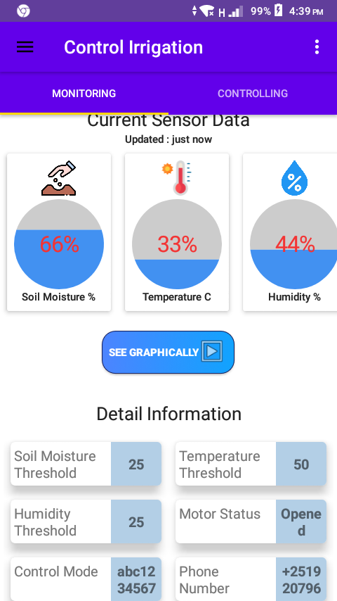
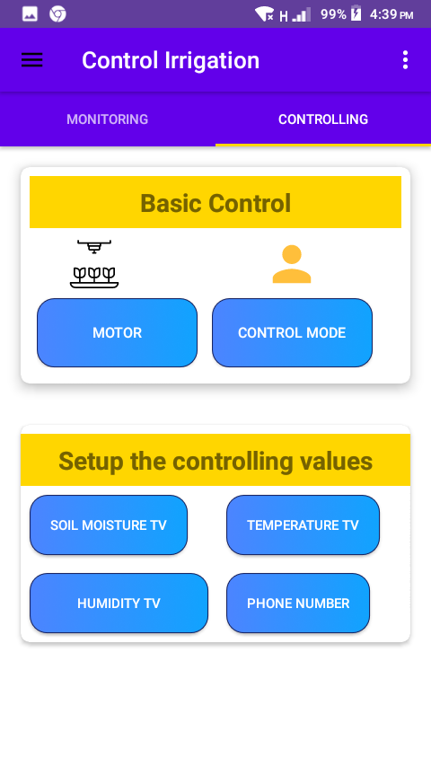
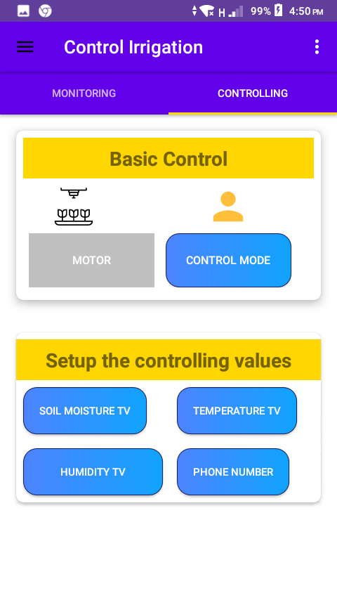
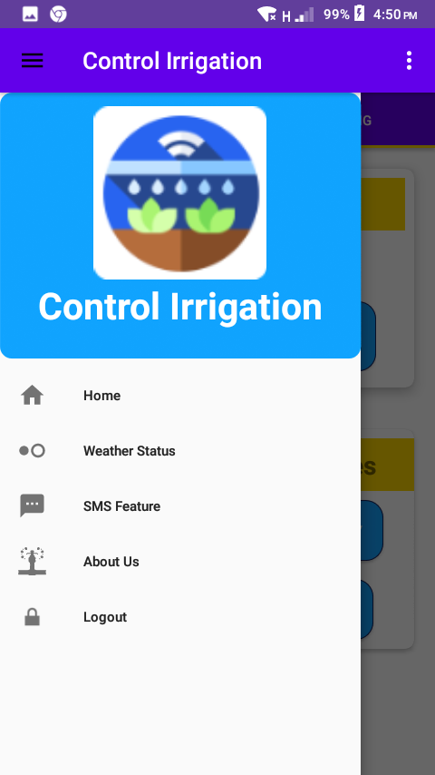

# IoT-SIS
IoT based Smart Irrigation System
this repo contains the android source code for controlling and monitoring plants
# Server
it connect with cloud database to fetch and update the datas
# Screenshots of android
## Dashboard

